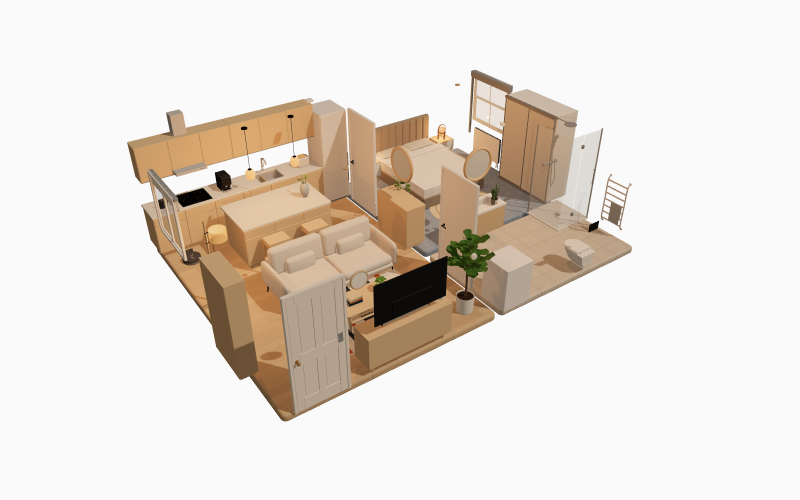
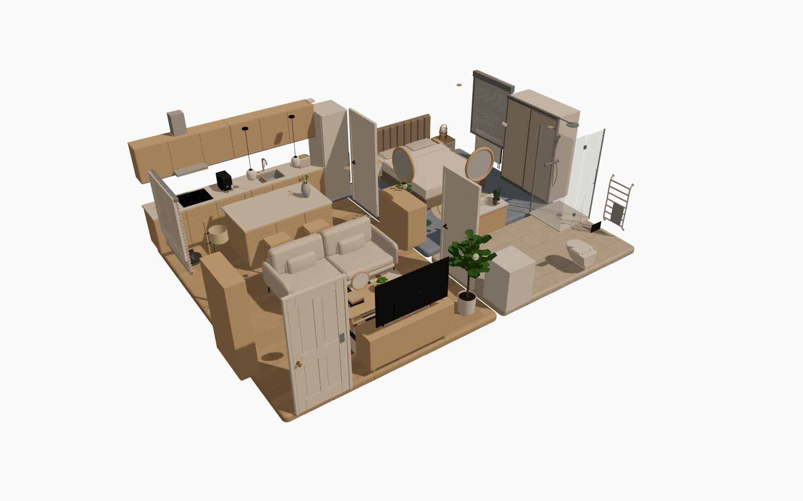
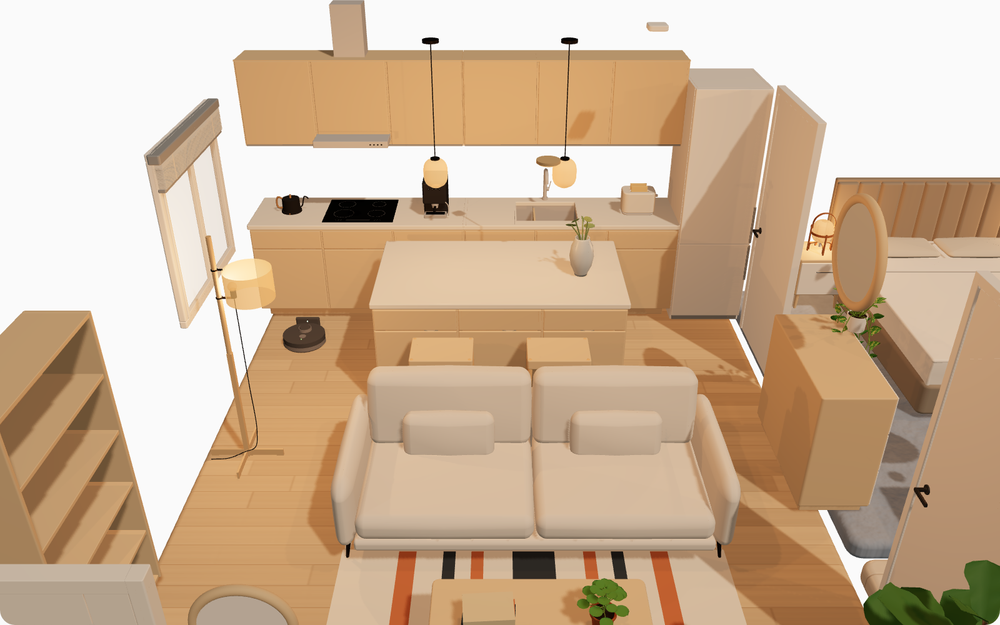
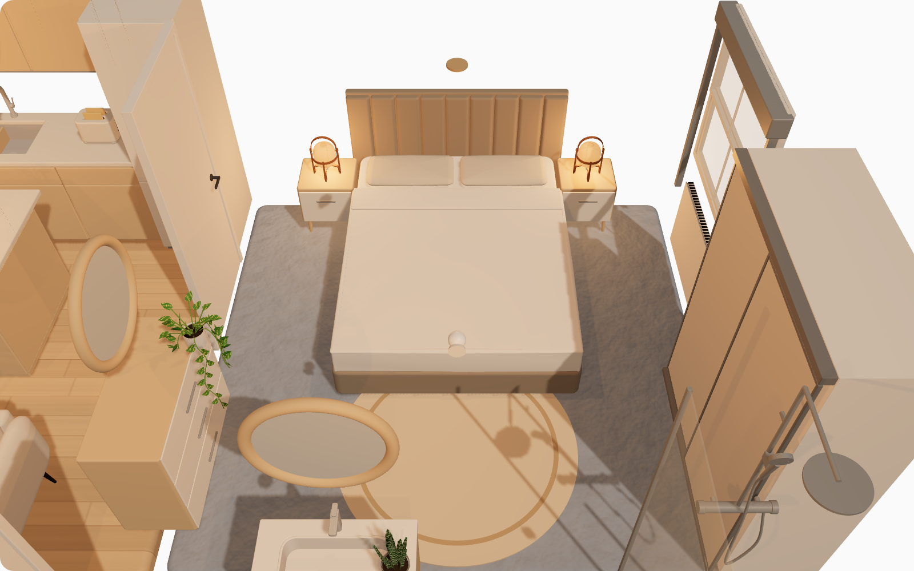
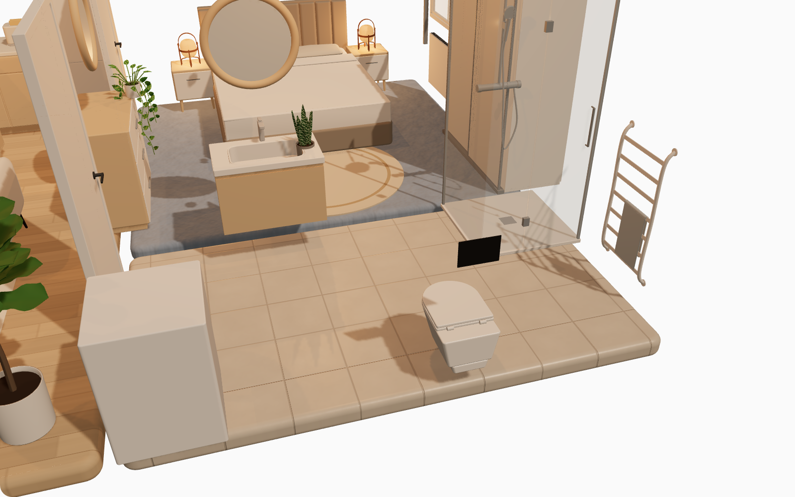
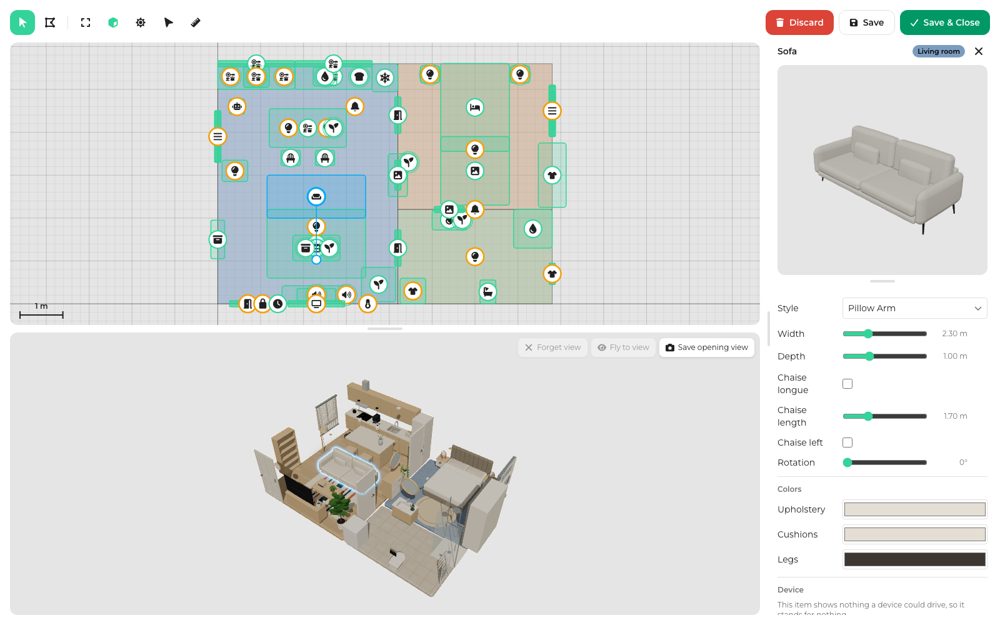

# Floorplan 3D

A Home Assistant card that turns your home into a small 3D model you can click.

Draw your rooms, furnish them from a catalog of sofas, lamps, doors, blinds, appliances and sensors, then bind the pieces to your real Home Assistant devices. The model shows what your home is doing right now: a lamp glows when the light is on, a blind sits where the cover is, a door swings open when the sensor says so. Click a piece and the device behind it toggles.

## What you get

- **Your own layout.** Trace each room on a grid in the visual editor. Walls, floor materials and openings follow.
- **A furnished home, not a floor plan.** Around a hundred pieces in several styles each: sofas, beds, kitchens, plants, rugs, mirrors, radiators, TVs, speakers, vacuum robots and more, each with its own size and color options.
- **Pieces that are devices.** Most pieces can stand for a Home Assistant entity. Lights, switches, covers, media players, fans, locks, climate, vacuums and binary sensors are all understood. The piece shows the entity's state, and a click calls the matching service: toggle, open or close, lock or unlock, start or dock.
- **Camera views.** Save the view the card opens with and one per room. Clicking a room's floor flies there, and a reset button brings you back.
- **Light that matters.** Lights cast real light and shadows in their room, with brightness and color temperature taken from the entity.

| Everything off                                                                      | Everything on                                                                |
| ----------------------------------------------------------------------------------- | ---------------------------------------------------------------------------- |
|  |  |

## A closer look

The same flat from inside. Each room has a saved camera view, so a click on its floor flies here.

## The editor

Everything is built inside Home Assistant, in the card's own full-screen editor. The plan sits on top, a live 3D preview below and the catalog on the right. Draw rooms, drop pieces in, drag them, snap them to walls, tweak their style and colors, and pick the entity each one stands for.

<!--
VIDEO PLACEHOLDER. Replace this comment with a short GIF or MP4 named docs/images/demo.gif (or .mp4) and the line:

How to record it (about 30 seconds, no audio):
1. Run `pnpm dev` and open http://localhost:5173/src/dev/demoflat.html in a browser window sized about 1280x800. This is the demo flat with fake entities, so clicks work without a Home Assistant instance.
2. Start a screen recording of that window (macOS: Shift+Cmd+5, record selected portion).
3. Card half, about 12 seconds: orbit the flat a little with the mouse, then click the floor lamp, the pendants over the island and the bedside lamps so they light up, click the living room blind so it rolls up, and click the front door so it opens.
4. Editor half, about 18 seconds: open http://localhost:5173/src/dev/demoflat.html?editor and click "Open editor". Choose the room tool and trace a small square room next to the flat. Pick a ceiling light from the catalog and drop it in the room, then pick a sofa, drop it, drag it to a wall and change its style in the side panel. Hover the light in the 3D preview and click it to see it turn on.
5. Stop, trim the ends, and convert to a GIF under 10 MB, for example with `ffmpeg -i demo.mov -vf "fps=15,scale=960:-1" docs/images/demo.gif`, or keep the MP4 and link it instead.
-->

## Install

### HACS

Until the card is in the HACS default list, add it as a custom repository.

1. In HACS open the three-dot menu in the top right and choose **Custom repositories**.
2. Paste `https://github.com/CarlesRojas/ha-floorplan`, pick the **Dashboard** type and add it.
3. Search for **Floorplan 3D** in HACS and download it. HACS registers the `card.js` resource for you.
4. Reload the browser, edit a dashboard, **Add card** and search for **Floorplan 3D**.

### Manual

1. Download `card.js` from the [latest release](https://github.com/CarlesRojas/ha-floorplan/releases/latest) into `config/www/floorplan-3d/card.js`.
2. In **Settings > Dashboards**, open the three-dot menu, choose **Resources** and add `/local/floorplan-3d/card.js` as a **JavaScript module**.
3. Edit a dashboard, **Add card** and search for **Floorplan 3D**.

When you update, bump the `?v=` query on the resource URL or clear the browser cache. The card logs its version in the browser console on load, so a stale copy is easy to spot.

## Start building

Add the card, press **Open editor** and trace your first room. Then open the catalog, drop in a ceiling light, pick the entity it stands for in the side panel, and save. Click the light in the card.

For a furnished starting point, paste [demoflat.yaml](demoflat.yaml) into a card's YAML editor. It is the flat in the screenshots above, with entity ids you can swap for your own.

The full reference, from every editor command to the card config and local development, is in the [guide](docs/GUIDE.md). Changes are listed in the [changelog](CHANGELOG.md).
