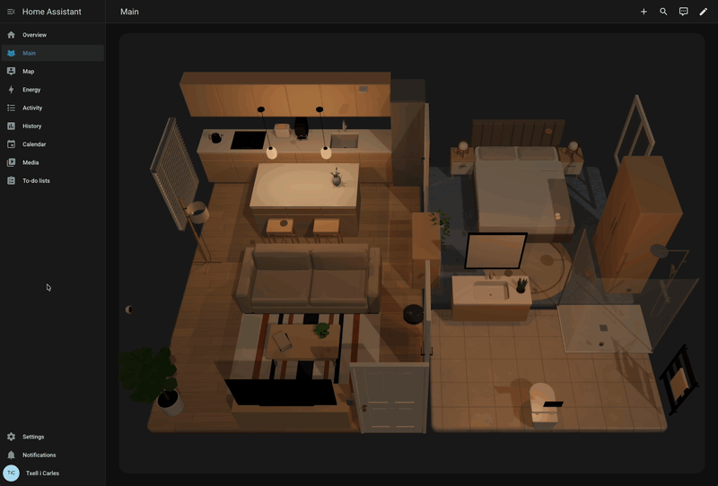
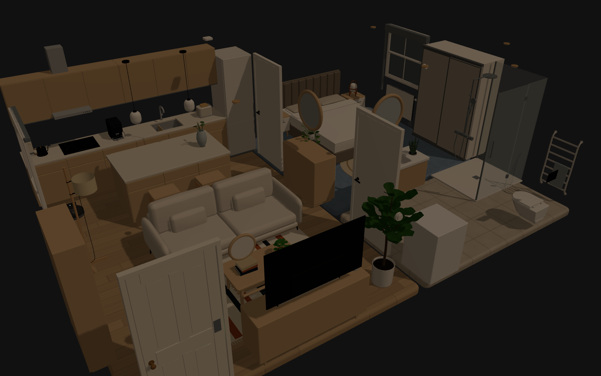
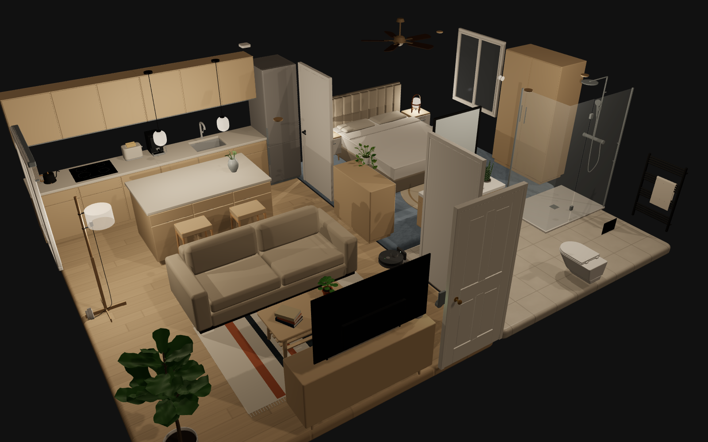
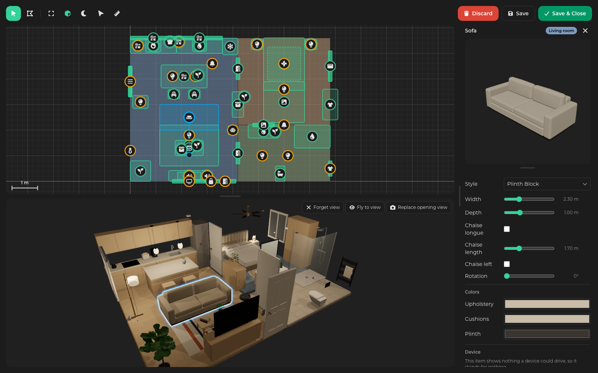

# Floorplan 3D

A Home Assistant card that turns your home into a small 3D model you can click.

Draw your rooms, furnish them from a catalog of sofas, lamps, doors, blinds, appliances and sensors, then bind the pieces to your real Home Assistant devices. The model shows what your home is doing right now: a lamp glows when the light is on, a blind sits where the cover is, a door swings open when the sensor says so. Click a piece and the device behind it toggles.

A sharper version of the clip is in [docs/video/demo.mp4](docs/video/demo.mp4).

## What you get

- **Your own layout.** Trace each room on a grid in the visual editor. Walls, floor materials and openings follow.
- **A furnished home, not a floor plan.** Around a hundred pieces in several styles each: sofas, beds, kitchens, plants, rugs, mirrors, radiators, TVs, speakers, vacuum robots and more, each with its own size and color options.
- **Pieces that are devices.** Most pieces can stand for a Home Assistant entity. Lights, switches, covers, media players, fans, locks, climate, vacuums and binary sensors are all understood. The piece shows the entity's state, and a click calls the matching service: toggle, open or close, lock or unlock, start or dock.
- **Camera views.** Save the view the card opens with and one per room. Clicking a room's floor flies there. Click it again, click the empty space around the home or press the reset button to come back.
- **Light that matters.** Lights cast real light and shadows in their room, with brightness and color temperature taken from the entity.

| Lights off                                                                | Lights on                                                                 |
| ------------------------------------------------------------------------- | ------------------------------------------------------------------------- |
|  |  |

## The editor

Everything is built inside Home Assistant, in the card's own full-screen editor. The plan sits on top, a live 3D preview below and the catalog on the right. Draw rooms, drop pieces in, drag them, snap them to walls, tweak their style and colors, and pick the entity each one stands for.

## Install

1. In Home Assistant open **HACS**, search for **Floorplan 3D** and download it. HACS registers the card's resource for you.
2. Reload the browser.
3. Edit a dashboard, choose **Add card** and search for **Floorplan 3D**.

Updates arrive through HACS like any other card. If a new version does not show up after updating, clear the browser cache. The card logs its version in the browser console on load, so a stale copy is easy to spot.

Not in your HACS search yet? Add it as a custom repository

1. In HACS open the three-dot menu in the top right and choose **Custom repositories**.
2. Paste `https://github.com/CarlesRojas/ha-floorplan`, pick the **Dashboard** type and add it.
3. Search for **Floorplan 3D** in HACS and download it, then follow the steps above.

Install by hand, without HACS

1. Download `card.js` from the [latest release](https://github.com/CarlesRojas/ha-floorplan/releases/latest) into `config/www/floorplan-3d/card.js`.
2. In **Settings > Dashboards**, open the three-dot menu, choose **Resources** and add `/local/floorplan-3d/card.js` as a **JavaScript module**.
3. Edit a dashboard, choose **Add card** and search for **Floorplan 3D**.

When you update, bump a `?v=` query on the resource URL so browsers pick up the new file.

## Start building

1. Add the card to a dashboard and press **Open editor**.
2. Trace your first room on the grid.
3. Open the catalog and drop in a ceiling light and a sofa.
4. Select the light and pick the Home Assistant entity it stands for.
5. Save, then click the light in the card. It lights up, and so does the real one.

For a furnished starting point, paste [demoflat.yaml](demoflat.yaml) into a card's YAML editor. It is the flat in the screenshots above, with entity ids you can swap for your own.

Changes are listed in the [changelog](CHANGELOG.md).
